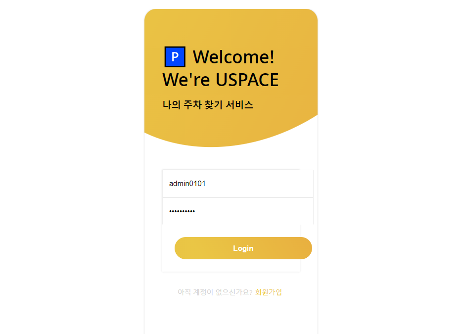
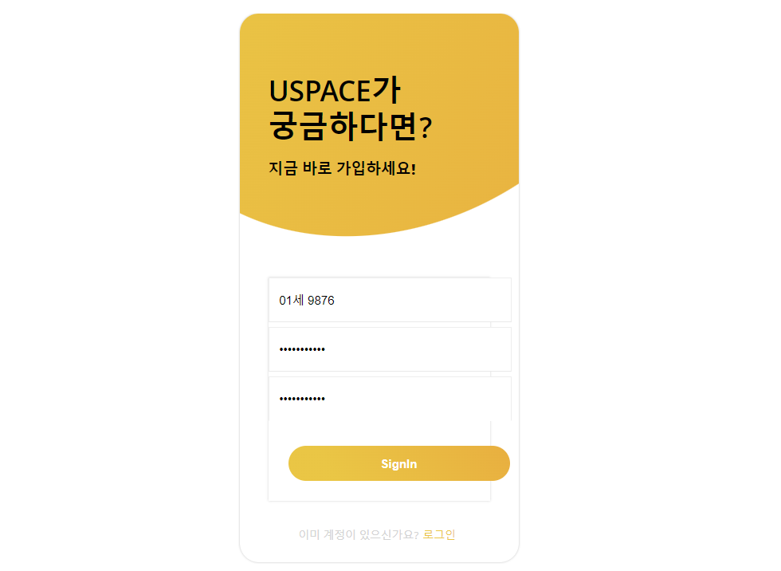
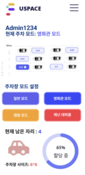
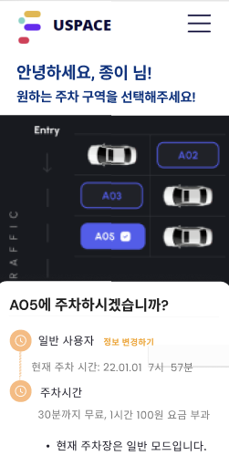

# USPACE(User Parking Space)

> 주차장 이용 및 관리를 위한 웹 어플리케이션, USPACE

* 웹 사이트 주소 (
https://uspace-sejong-doctorpc.netlify.app )

## USPACE만의 기능
|관리자|일반 사용자|
|------|---|
|관리자로 회원가입 및 로그인|일반 사용자로 회원가입 및 로그인|
|주차 현황 조회|주차 현황 조회|
|전체 주차 정보 조회|직접 주차 자리 예약|
|필요 시 주차 공간 할당, 주차 공간 모드 변경|주차 후 주차 위치와 요금 조회|

---
---

## 기술 스택
* 프론트엔드: React.js
    - 개발 프레임워크: React
    - 개발 언어: Javascript
    - UI: styled component, SCSS, MUI
    - 배포: Netlify
* [백엔드](https://github.com/Sejong-DoctorPC/USPACE_BE)

## USPACE Frontend
### 메인홈

### 회원가입 및 로그인

### 관리자(Admin)
* 주차장 생성 및 조회

</img> 

### 일반 회원
* 주차 현황 조회 및 주차 정보 확인

</img> 

---

### More about USPACE
* [USPACE Notion 링크](https://spiced-organ-962.notion.site/USPACE-d78f838cedc24fe290113caa7d1374d2)
